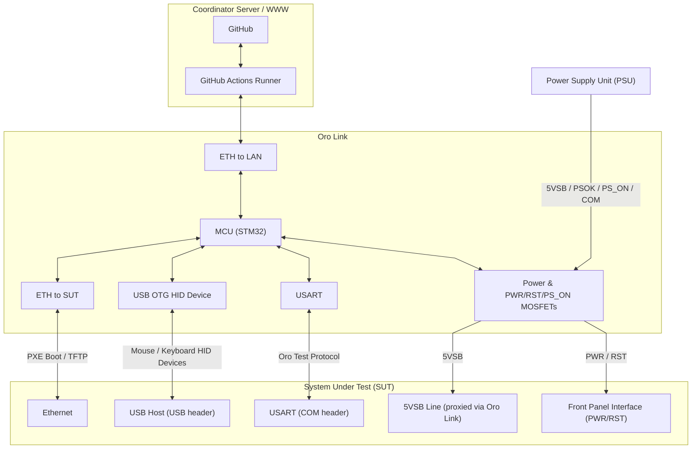

	

# Oro Link (for x86 machines)

This is the Oro Link for x86 machines, a custom PCB for the testing of
the Oro Operating System via CI/CD pipelines and GitHub Actions.

The link is a physical board that interfaces with the ports and headers
of an x86-based desktop computer and runs firmware to obtain builds of
the Oro kernel and associated modules to send to the System Under Test (SUT)
for automated testing and reporting.

The Oro Link allows contributors to the Oro project direct access via
GitHub Actions the ability to test changes directly on real hardware
alongside emulated environments, allowing for changes to be tested
against niche or problematic hardware configurations.

## Block Diagram

The Oro Link has an STM32 F479VGT6 microcontroller unit (MCU) that
operates several external controllers for interacting with the SUT.

Most notably, the dual-ethernet configuration allows for a completely
isolated network environment for the SUT whilst still being able to
communicate with the outside world (e.g. to stream test results to
the GitHub Actions runner), along with the ability to PXE boot the
newly built Kernel images as part of a release or pull request CI/CD
pipeline.

The Oro Link also provides a USB HID device interface for testing
mouse, keyboard, and other HID input devices.

The Oro Link is intended to test all external user interaction,
including the power and reset buttons, which are controlled via
MOSFETs via the SUT's motherboard's front panel bus header.

Along with the ability to control the power and reset buttons,
the Link can also cut power directly to the system via the `PS_ON`
line of the Power Supply Unit (PSU) in cases where tests have failed,
timed out, or where the SUT is otherwise un-responsive.

# License

	

Part of the Oro Operating System project.

The Oro Link is released to the public, WARRANTY FREE
and provided AS IS. The Oro project and its contributors are NOT
responsible for any damages caused by the purchase, assembly, or operation
of the device, under any circumstances.

The Oro Link's PCB and associated custom footprints are released
under the [MIT License](LICENSE).

The _Enter Command_ font used for text display is released CC-BY-4.0
by [Font End Dev (jeti)](https://fontenddev.com).

Unless otherwise specified, all Oro Link firmware (software code)
is licensed under the same license. Please note that much of the
generated code is provided by the STM32 toolchain and is separately
licensed. Please refer to their respective licenses and copyrights,
provided inline.

All other materials are, unless otherwise specified, provided
under the same license.
