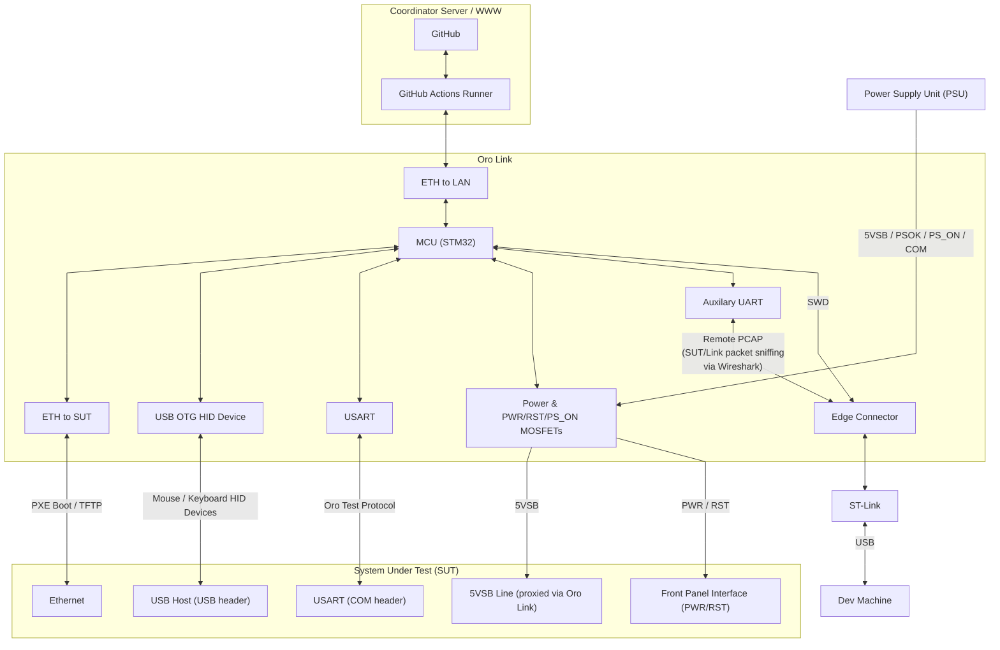

# x86 Oro Link

This folder houses the firmware for the x86 version of the Oro Link,
meant for testing x86 and x86_64 machines.

## Block Diagram

The x86 Oro Link has an STM32 F479VGT6 microcontroller unit (MCU) that
operates several external controllers for interacting with the SUT.

Most notably, the dual-ethernet configuration allows for a completely
isolated network environment for the SUT whilst still being able to
communicate with the outside world (e.g. to stream test results to
the GitHub Actions runner), along with the ability to PXE boot the
newly built Kernel images as part of a release or pull request CI/CD
pipeline.

The Oro Link also provides a USB HID device interface for testing
mouse, keyboard, and other HID input devices.

The Oro Link is intended to test all external user interaction,
including the power and reset buttons, which are controlled via
MOSFETs via the SUT's motherboard's front panel bus header.

Along with the ability to control the power and reset buttons,
the Link can also cut power directly to the system via the `PS_ON`
line of the Power Supply Unit (PSU) in cases where tests have failed,
timed out, or where the SUT is otherwise un-responsive.

The link also sniffs and traces all packets sent/received by the
Link/SUT ethernet controller (using the `link-rpcap` utility),
allowing for applications like WireShark to connect and sniff
all packets sent between the two for debugging purposes.

